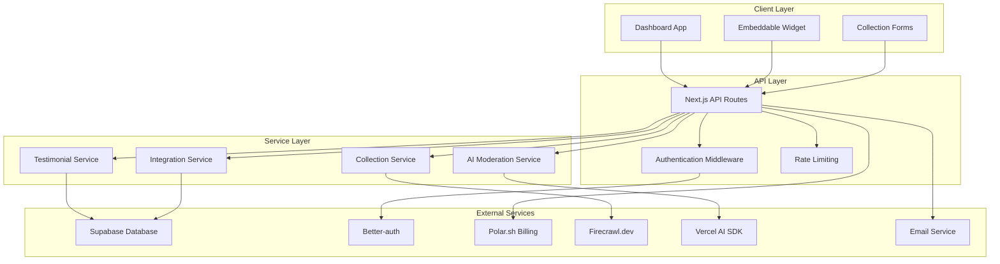

# Design Document

## Overview

The testimonial collection system is built as a modern SaaS platform using Next.js with the app router, providing both server-side rendering for SEO and client-side interactivity. The architecture follows a modular approach with clear separation between the dashboard application, embeddable widget, and various collection services.

The system leverages Supabase for database operations and real-time subscriptions, Better-auth for authentication, Polar.sh for subscription management, and integrates with external services like Firecrawl.dev for web scraping and various support tools for automated testimonial collection.

## Architecture

### High-Level Architecture



### Database Architecture

The system uses Supabase PostgreSQL with the following key tables:

- **users**: User accounts and authentication data
- **projects**: Testimonial collection projects
- **testimonials**: Individual testimonial records
- **integrations**: Third-party service connections
- **invitations**: Email invitation tracking
- **subscriptions**: Billing and plan information

### Widget Architecture

The embeddable widget is designed as a lightweight, self-contained component that:
- Loads asynchronously to avoid blocking the host website
- Uses Shadow DOM for style isolation
- Fetches data from CDN-cached endpoints
- Supports responsive design and customization

## Components and Interfaces

### Core Components

#### Dashboard Application
- **ProjectDashboard**: Main project management interface
- **TestimonialManager**: Approval and moderation interface
- **IntegrationHub**: Third-party service connections
- **AnalyticsDashboard**: Usage statistics and insights
- **BillingInterface**: Subscription and payment management

#### Embeddable Widget
- **TestimonialDisplay**: Responsive testimonial carousel/grid
- **CollectionModal**: Popup form for new testimonial submission
- **WidgetLoader**: Async loading and initialization script

#### Collection Services
- **EmailInviteService**: Manages invitation campaigns
- **WebScrapingService**: Firecrawl.dev integration for content discovery
- **IntegrationService**: Support tool API connections
- **ImportService**: CSV and bulk upload processing

#### AI Services
- **AIPromptService**: Generates contextual questions based on product features
- **AIEnhancementService**: Provides headline suggestions and content improvements
- **AIAnalyticsService**: Analyzes testimonials for themes, keywords, and sentiment
- **AITaggingService**: Categorizes testimonials for contextual display
- **AIModerationService**: Content moderation and spam detection

### API Interfaces

#### Testimonial Management API
```typescript
interface TestimonialAPI {
  // CRUD operations
  createTestimonial(data: TestimonialInput): Promise<Testimonial>
  getTestimonials(projectId: string, filters?: TestimonialFilters): Promise<Testimonial[]>
  updateTestimonialStatus(id: string, status: 'pending' | 'approved' | 'rejected'): Promise<void>
  
  // Collection methods
  scrapeWebsiteTestimonials(url: string): Promise<ScrapedTestimonial[]>
  importFromCSV(file: File, projectId: string): Promise<ImportResult>
  syncIntegrationData(integrationId: string): Promise<SyncResult>
}
```

#### Widget API
```typescript
interface WidgetAPI {
  getPublicTestimonials(projectId: string): Promise<PublicTestimonial[]>
  submitTestimonial(projectId: string, data: TestimonialSubmission): Promise<SubmissionResult>
  getWidgetConfig(projectId: string): Promise<WidgetConfig>
}
```

#### Integration API
```typescript
interface IntegrationAPI {
  connectService(type: IntegrationType, credentials: ServiceCredentials): Promise<Integration>
  syncData(integrationId: string): Promise<SyncResult>
  getAvailableIntegrations(): Promise<IntegrationType[]>
}
```

#### AI Services API
```typescript
interface AIPromptAPI {
  generateContextualQuestions(productFeature: string, context: string): Promise<string[]>
  getPromptFlow(projectId: string, featureTag?: string): Promise<PromptFlow>
}

interface AIEnhancementAPI {
  suggestHeadlines(testimonialContent: string): Promise<string[]>
  enhanceContent(content: string): Promise<ContentSuggestions>
  extractKeyPhrases(content: string): Promise<string[]>
}

interface AIAnalyticsAPI {
  analyzeTestimonials(projectId: string): Promise<TestimonialInsights>
  getThemeAnalysis(testimonials: Testimonial[]): Promise<ThemeAnalysis>
  generateMarketingCopy(insights: TestimonialInsights): Promise<MarketingCopySuggestions>
}

interface AITaggingAPI {
  tagTestimonial(testimonial: Testimonial): Promise<string[]>
  getContextualTestimonials(projectId: string, tags: string[]): Promise<Testimonial[]>
  updateTestimonialTags(testimonialId: string, tags: string[]): Promise<void>
}
```

## Data Models

### Core Data Models

#### User Model
```typescript
interface User {
  id: string
  email: string
  name: string
  createdAt: Date
  subscription: {
    plan: 'free' | 'pro' | 'enterprise'
    status: 'active' | 'canceled' | 'past_due'
    currentPeriodEnd: Date
  }
}
```

#### Project Model
```typescript
interface Project {
  id: string
  userId: string
  name: string
  description: string
  websiteUrl?: string
  brandName?: string
  socialLinks?: string[]
  embedCode: string
  productFeatures?: string[] // For AI prompt generation
  contextTags?: string[] // For contextual testimonial display
  settings: {
    autoApprove: boolean
    moderationLevel: 'strict' | 'moderate' | 'lenient'
    aiPrompts: boolean // Enable AI-guided prompts
    aiEnhancement: boolean // Enable AI content suggestions
    displaySettings: WidgetDisplaySettings
  }
  createdAt: Date
  updatedAt: Date
}
```

#### Testimonial Model
```typescript
interface Testimonial {
  id: string
  projectId: string
  customerName: string
  customerEmail: string
  customerCompany?: string
  customerTitle?: string
  content: string
  rating?: number
  status: 'pending' | 'approved' | 'rejected' | 'flagged'
  source: 'manual' | 'email_invite' | 'scraped' | 'integration' | 'imported'
  sourceMetadata?: {
    url?: string
    integrationId?: string
    originalId?: string
  }
  moderationScore?: number
  moderationFlags?: string[]
  createdAt: Date
  approvedAt?: Date
}
```

#### Integration Model
```typescript
interface Integration {
  id: string
  userId: string
  projectId: string
  type: 'zendesk' | 'intercom' | 'helpscout' | 'freshdesk'
  credentials: EncryptedCredentials
  settings: {
    syncFrequency: 'hourly' | 'daily' | 'weekly'
    autoImport: boolean
    minimumRating?: number
  }
  lastSyncAt?: Date
  status: 'active' | 'error' | 'paused'
}
```

### Database Schema

```sql
-- Users table
CREATE TABLE users (
  id UUID PRIMARY KEY DEFAULT gen_random_uuid(),
  email VARCHAR(255) UNIQUE NOT NULL,
  name VARCHAR(255) NOT NULL,
  created_at TIMESTAMP WITH TIME ZONE DEFAULT NOW(),
  updated_at TIMESTAMP WITH TIME ZONE DEFAULT NOW()
);

-- Projects table
CREATE TABLE projects (
  id UUID PRIMARY KEY DEFAULT gen_random_uuid(),
  user_id UUID REFERENCES users(id) ON DELETE CASCADE,
  name VARCHAR(255) NOT NULL,
  description TEXT,
  website_url VARCHAR(500),
  brand_name VARCHAR(255),
  social_links JSONB,
  embed_code VARCHAR(50) UNIQUE NOT NULL,
  settings JSONB DEFAULT '{}',
  created_at TIMESTAMP WITH TIME ZONE DEFAULT NOW(),
  updated_at TIMESTAMP WITH TIME ZONE DEFAULT NOW()
);

-- Testimonials table
CREATE TABLE testimonials (
  id UUID PRIMARY KEY DEFAULT gen_random_uuid(),
  project_id UUID REFERENCES projects(id) ON DELETE CASCADE,
  customer_name VARCHAR(255) NOT NULL,
  customer_email VARCHAR(255) NOT NULL,
  customer_company VARCHAR(255),
  customer_title VARCHAR(255),
  content TEXT NOT NULL,
  rating INTEGER CHECK (rating >= 1 AND rating <= 5),
  status VARCHAR(20) DEFAULT 'pending',
  source VARCHAR(20) NOT NULL,
  source_metadata JSONB,
  moderation_score DECIMAL(3,2),
  moderation_flags JSONB,
  created_at TIMESTAMP WITH TIME ZONE DEFAULT NOW(),
  approved_at TIMESTAMP WITH TIME ZONE
);

-- Integrations table
CREATE TABLE integrations (
  id UUID PRIMARY KEY DEFAULT gen_random_uuid(),
  user_id UUID REFERENCES users(id) ON DELETE CASCADE,
  project_id UUID REFERENCES projects(id) ON DELETE CASCADE,
  type VARCHAR(50) NOT NULL,
  credentials JSONB NOT NULL,
  settings JSONB DEFAULT '{}',
  last_sync_at TIMESTAMP WITH TIME ZONE,
  status VARCHAR(20) DEFAULT 'active',
  created_at TIMESTAMP WITH TIME ZONE DEFAULT NOW()
);
```

## Error Handling

### Error Classification

#### Client Errors (4xx)
- **400 Bad Request**: Invalid input data, malformed requests
- **401 Unauthorized**: Authentication required or invalid
- **403 Forbidden**: Insufficient permissions or subscription limits
- **404 Not Found**: Resource doesn't exist
- **429 Too Many Requests**: Rate limiting exceeded

#### Server Errors (5xx)
- **500 Internal Server Error**: Unexpected server errors
- **502 Bad Gateway**: External service integration failures
- **503 Service Unavailable**: Temporary service outages

### Error Handling Strategy

#### API Error Responses
```typescript
interface APIError {
  error: {
    code: string
    message: string
    details?: Record<string, any>
    timestamp: string
  }
}
```

#### Client Error Handling
- Implement retry logic with exponential backoff for transient errors
- Display user-friendly error messages with actionable guidance
- Log errors to monitoring service for debugging
- Graceful degradation for non-critical features

#### Integration Error Handling
- Implement circuit breaker pattern for external service calls
- Queue failed operations for retry
- Notify users of integration issues with clear resolution steps
- Maintain service status dashboard

## Testing Strategy

### Testing Pyramid

#### Unit Tests (70%)
- **Service Layer**: Business logic, data transformations, validation
- **Utility Functions**: Helper functions, formatters, validators
- **Components**: React component behavior and rendering
- **API Routes**: Request/response handling, authentication

#### Integration Tests (20%)
- **Database Operations**: CRUD operations, data integrity
- **External Service Integration**: API calls, webhook handling
- **Authentication Flow**: Login, logout, session management
- **Email Services**: Template rendering, delivery confirmation

#### End-to-End Tests (10%)
- **User Workflows**: Complete user journeys from signup to testimonial collection
- **Widget Integration**: Embedding and functionality on external sites
- **Payment Flow**: Subscription signup and billing processes
- **Cross-browser Compatibility**: Widget functionality across different browsers

### Testing Tools and Framework

#### Frontend Testing
- **Jest + React Testing Library**: Component unit tests
- **Playwright**: End-to-end testing
- **Storybook**: Component documentation and visual testing

#### Backend Testing
- **Jest**: API route and service testing
- **Supertest**: HTTP assertion testing
- **Supabase Test Client**: Database operation testing

#### Integration Testing
- **Mock Service Worker (MSW)**: API mocking for external services
- **Test Containers**: Database testing with isolated environments
- **Webhook Testing**: ngrok for local webhook development

### Test Data Management

#### Test Database
- Separate test database instance
- Automated test data seeding
- Database cleanup between test runs
- Realistic test data generation

#### Mock External Services
- Firecrawl.dev API responses
- Support tool API responses
- Email service confirmations
- Payment webhook events

This design provides a solid foundation for building a scalable, maintainable testimonial collection system that can handle multiple collection methods, integrate with various external services, and provide a smooth user experience across all touchpoints.