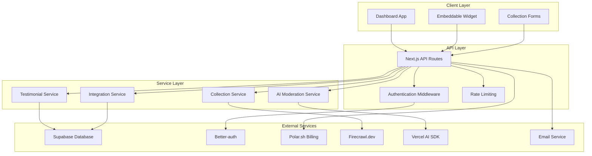

# Testimonial Collection System

## A Clear Vision: Redefining Social Proof in the Digital Age

**Our Vision:** To make every website a dynamic, trustworthy, and conversion-optimized experience powered by authentic, relevant, and effortless customer feedback.

## Why We Exist (Our Mission)

We are building this tool because the current testimonial landscape is broken. Businesses struggle to get specific, high-quality testimonials, and once they do, the testimonials quickly become stale and are often displayed in a generic, ineffective way. The result is a missed opportunity for powerful social proof that could significantly impact growth and conversions.

We exist to solve this problem by leveraging the power of AI to transform how businesses collect and display testimonials, making the process automated, intelligent, and highly effective. We believe that every customer's voice is a powerful asset, and our mission is to empower businesses to harness that voice with minimal effort.

## What We're Building: Our Tool in a Nutshell

Our tool is a simple-to-integrate SaaS platform that automates the collection of high-quality, targeted testimonials and intelligently displays them on a business's website. It is specifically designed for B2B / B2C SaaS companies, online course creators, and digital product owners who understand that conversion is tied to trust and relevance.

## Key Features (The "What")

### 🎯 AI-Guided Testimonial Generation
We don't just provide a blank text box. Our tool uses AI to generate specific, relevant questions based on the product or feature a customer has used. This guides the customer to provide meaningful feedback focused on their problem, the solution, and the result, yielding much more valuable content than generic "We love your product!" feedback.

### 🎨 Contextual & Dynamic Display
Our lightweight, embeddable widgets are intelligent. They don't just show a random stream of testimonials. Businesses can tag testimonials and widgets to display only the most relevant feedback for the specific page a user is viewing. For example, a visitor on the "Analytics Dashboard" feature page will only see testimonials praising the analytics dashboard, creating a highly personalized and persuasive experience.

### ⚡ One-Click Publishing & Moderation
The business owner receives a new testimonial and, with a single click, can approve it for display. This eliminates the manual hassle of copy-pasting, formatting, and updating a website every time new feedback is received.

### 🔧 Effortless Integration
We provide a single line of code that businesses can add to their websites. Our tool handles the rest, from the testimonial collection button to the dynamic display widgets, ensuring a fast and seamless setup.

### 🤖 Multi-Source Collection
- **Web Scraping**: Automatically import existing reviews using Firecrawl.dev
- **Third-Party Integrations**: Connect with support tools (Zendesk, Intercom, Help Scout)
- **Email Invitations**: Send personalized testimonial requests
- **CSV Import**: Bulk upload existing testimonials
- **AI Analytics**: Understand what customers value most through sentiment analysis

## How We're Different (Our Competitive Edge)

While there are many testimonial tools available, they often fall short in two critical areas: quality of content and relevance of display.

### Existing Tools
Mostly act as a "dumb" container. They collect and store testimonials, but the quality of the submitted content is often generic and low-value. They offer widgets that display all testimonials in a stream or carousel, lacking the ability to show a visitor the specific feedback they need to see to convert. They are a passive repository.

### Our Tool
Is an active conversion engine. We use AI to solve the core problem of getting high-quality testimonials in the first place. By guiding the user, we ensure the testimonials are problem-focused and highly persuasive. By offering contextual display, we ensure that the right testimonial is shown to the right person at the right time, maximizing its impact. We don't just host testimonials; we turn them into an intelligent, dynamic, and powerful marketing asset that proves ROI.

**Our tool isn't just about collecting testimonials; it's about collecting the right testimonials and using them smarter to drive growth.**



## Tech Stack

- **Frontend**: Next.js (app router) for dashboard + landing pages
- **Backend**: Next.js API routes + Supabase for database/storage
- **Auth**: Better-auth (modern authentication solution)
- **Payments**: Polar.sh (clean SaaS billing)
- **AI**: Vercel AI SDK for testimonial moderation/enhancement
- **Hosting**: Vercel
- **Email**: Resend or Postmark for invitation emails
- **CDN**: Vercel Edge for fast widget loading globally
- **Analytics**: Event tracking for insights

## Getting Started

This project follows a comprehensive spec-driven development approach. To begin implementation:

1. **Review the Spec**: Check out the complete specification in `.kiro/specs/testimonial-collection-system/`
   - `requirements.md` - Detailed feature requirements
   - `design.md` - System architecture and design
   - `tasks.md` - Implementation plan with 24 actionable tasks

2. **Start Implementation**: Open `tasks.md` and begin with Task 1 (project foundation)

3. **Follow the Plan**: Each task builds incrementally and references specific requirements

## MVP Timeline

**Target**: 2-3 weeks for initial launch with core features:
- Dashboard for project management
- Embeddable widget with testimonial display
- AI-guided testimonial collection
- Basic approval workflow
- Email invitation system

## Project Structure

```
├── .kiro/specs/testimonial-collection-system/  # Complete project specification
├── src/app/                                    # Next.js app router pages
├── src/components/                             # React components
├── src/lib/                                    # Utility functions and services
├── src/types/                                  # TypeScript type definitions
└── public/                                     # Static assets
```

## Contributing

This project follows the implementation plan outlined in the spec. Each task should be completed sequentially to ensure proper integration and testing.

---

*Building the future of intelligent social proof, one testimonial at a time.*